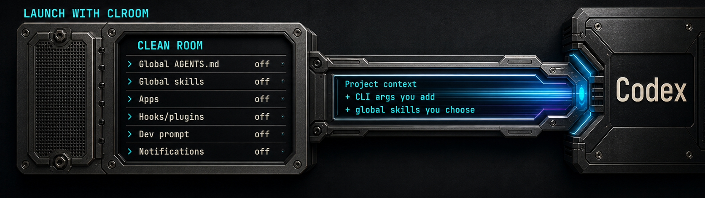

# Clean Room Launcher



A clean-room launcher for coding agents (Codex for now).

## Launch your coding agent without unrelated instructions and skills.

Unrelated global rules, skills from other work, and forgotten instructions are
not loaded, so you know what is guiding the agent. You do not need to review,
remove, or change your existing setup. It stays exactly as it is.

Use the automatic clean launch immediately.

## Why this exists

Codex can discover instructions, skills, and configuration from more than the
directory in front of you. Those sources accumulate over time. They may still
be useful, but they do not belong in every launch.

Clean Room Launcher creates a temporary, explicit context boundary for the
launch you are making now. It does not solve the problem by deleting your setup
or asking you to clean it by hand.

The result is not an empty agent. It is the Codex CLI you already use, with the
current project available and unrelated ambient inputs kept outside.

## Use the global skills you need without loading the rest.

A clean launch should not force an all-or-nothing choice. Project-local skills
are available automatically. When this run needs something from your global
toolkit, compose its skill set in the command.

```sh
# Two exact global skills
clroom codex --skill-set=code-review,testing --approve-for-me

# One exact global skill and one exact namespaced skill
clroom codex --skill-set=code-review,security:dependency-audit --approve-for-me
```

Use selectors installed in your own setup; the names above illustrate the
syntax. A bare name selects one exact global skill or, when it names a
namespace, every discovered skill in that namespace. `namespace:skill`
selects only that namespaced skill.

For combinations you use repeatedly, define named sets in one file:

```yaml
# ~/.config/clroom/skill-sets.yaml
review:
  - code-review
  - security:dependency-audit

debugging:
  - systematic-debugging
  - testing

documentation:
  - technical-writing
```

Prefix a saved set with `@`. Direct selectors and any number of saved sets can
share the same option:

```sh
clroom codex --skill-set=@review,@debugging,@documentation --approve-for-me
clroom codex --skill-set=@review,testing --approve-for-me
```

`clroom --help` shows the exact resolved path of the file. Edit that YAML file
to add, rename, combine, or remove sets. Clean Room Launcher reads it only when
an `@set` is requested and never creates or rewrites it.

Unknown or ambiguous selectors stop before Codex starts. The selection lasts
for one launch. Overlapping entries are admitted once, and nested `@sets` are
rejected before Codex starts.

## See the boundary as Codex starts

Run `clroom codex` from the directory where you want to work.

Before Codex takes over the terminal, Clean Room Launcher shows a compact
summary of the active boundary:

- global Codex `AGENTS.md` files are blocked;
- known global skill roots stay blocked except for skills you selected;
- apps, hooks, and plugins are off by default;
- developer instructions and notifications are cleared by default.

The plaque reports how many global skills were admitted. Project context,
project-local skills, and explicit Codex arguments remain available.

Codex then starts immediately in the same terminal. There is no menu,
confirmation step, second launch, or artificial delay.

## Install in sixty seconds

You need macOS on Apple Silicon and an already installed, working `codex` CLI.

```sh
VERSION=v0.1.0-alpha.2
ASSET=clean-room-launcher-v0.1.0-alpha.2-aarch64-apple-darwin.tar.gz

curl -fLO "https://github.com/ewgenij87snwork/clean-room-launcher/releases/download/$VERSION/$ASSET"
curl -fLO "https://github.com/ewgenij87snwork/clean-room-launcher/releases/download/$VERSION/SHA256SUMS"
shasum -a 256 -c SHA256SUMS
tar -xzf "$ASSET"

mkdir -p "$HOME/.local/bin"
install -m 0755 "clean-room-launcher-v0.1.0-alpha.2-aarch64-apple-darwin/bin/clroom" "$HOME/.local/bin/clroom"
export PATH="$HOME/.local/bin:$PATH"
clroom --help
```

The `export` makes `clroom` available in the current terminal. To keep it
available in new terminals, add `$HOME/.local/bin` to your shell's `PATH`.

The archive is unsigned and unnotarized. If local macOS policy refuses it,
prefer the Cargo installation below. Do not disable Gatekeeper globally.

## Install with Cargo

Rust users can build the same alpha from the public tag:

```sh
cargo install --git https://github.com/ewgenij87snwork/clean-room-launcher \
  --tag v0.1.0-alpha.2 --locked
```

No crates.io package is published for this alpha.

## Start clean

For a low-friction Codex launch with eligible approval requests handled by
Codex Auto-review:

```sh
cd your-project
clroom codex --approve-for-me
```

`--approve-for-me` is a Codex option. It keeps the Codex workspace sandbox and
routes eligible approval requests through its automatic reviewer. Availability
and reviewer behavior are controlled by the installed Codex version and
account.

If you prefer to review approval requests yourself:

```sh
clroom codex
```

Ordinary Codex arguments pass through unchanged:

```sh
clroom codex --help
clroom codex --enable apps --enable hooks --enable plugins
```

## How it works

1. **Resolve Codex locally.** Clean Room Launcher finds the installed `codex`
   executable through `PATH`. It does not install or replace Codex.

2. **Establish the boundary.** It creates a narrow macOS Seatbelt policy that
   denies reads of global Codex instruction files and known ambient skill roots.

3. **Admit your selected skills.** Direct global skill selectors and named
   `@sets` composed with `--skill-set=` are readable for this launch only.
   Project-local skills remain available automatically.

4. **Apply clean defaults.** It starts Codex with apps, hooks, and plugins off,
   empty developer instructions, and no notifications.

5. **Show the boundary.** The launcher prints the compact `CLEAN ROOM` status
   plaque and selected-skill count before Codex starts.

6. **Launch the original CLI.** Clean Room Launcher replaces itself with Codex.
   Codex remains the foreground process and retains normal terminal input,
   output, signals, and exit behavior.

Clean Room Launcher makes no model request and performs no provider login before
Codex starts.

## What it changes and what it leaves alone

| For this launch | Left unchanged |
|---|---|
| Global Codex instruction files are unavailable | Those files remain untouched on disk |
| Unselected global skill roots are unavailable | Existing skills remain untouched on disk |
| Selected global skills are readable for one launch | No skill is copied, installed, or enabled permanently |
| Apps, hooks, and plugins are off by default | Explicit user arguments can re-enable them |
| Developer instructions and notifications are cleared by default | Codex configuration is not rewritten |
| The selected project remains available | Project files, Git history, and project instructions remain untouched |
| Codex starts inside the launcher boundary | Codex installation, login, and provider state remain owned by Codex |

Clean Room Launcher does not need to copy authentication data into its own
configuration. It does not open a browser or ask you to sign in.

## Trust boundary

Clean Room Launcher provides a focused context boundary. It is not a virtual
machine, container, network sandbox, complete home-directory sandbox,
permission broker, coding-agent proxy, or hosted coding service.

Its macOS Seatbelt policy blocks the documented global instruction files and
known skill roots, then admits only the resolved global skill directories you
selected. Other project and host paths remain available unless macOS or Codex
applies another restriction.

The launcher does not make unsafe commands safe and does not replace Codex
sandbox or approval controls.

Codex may display `Operation not permitted` when it probes a blocked global
`AGENTS.md` file. That warning is expected: the clean-room boundary denied the
read. It does not mean Codex failed to start.

If the required macOS isolation boundary cannot be created, Clean Room Launcher
fails instead of silently starting a normal inherited Codex session.

See [the current limitations](docs/limitations.md) and
[security policy](SECURITY.md).

## Coding-agent support

The current alpha supports one path:

| Coding agent | Platform | Status |
|---|---|---|
| Locally installed Codex CLI | macOS / Apple Silicon | Alpha |

Claude, Linux, Windows, Intel macOS, Homebrew, crates.io, signing, and
notarization are not supported by this release.

Additional coding agents and platforms may be considered later, but this README
makes no support claim for them.

## Frequently asked questions

### Does it delete or rewrite my existing setup?

No. Existing instructions, skills, Codex settings, and other projects stay where
they are. The boundary applies only to the launched process.

### Does it remove all context from Codex?

No. Your selected project, project-local skills, and any global skills you
explicitly selected remain available. Codex also keeps its own built-in
behavior. Clean Room Launcher keeps the other specified ambient global inputs
outside this launch.

### Do I need another account or subscription?

No. Clean Room Launcher starts your existing Codex CLI. Codex continues to own
its account, subscription, authentication, and provider connection.

### Does Clean Room Launcher read or copy my credentials?

No. It does not request, inspect, or copy provider credentials. Codex accesses
its existing provider state itself after launch.

### Is this a complete operating-system sandbox?

No. It uses macOS Seatbelt to enforce a narrow filesystem denylist. It does not
block the network, isolate every home-directory file, or replace a VM or
container.

### Can I see what was cleaned?

Yes. The launch plaque shows the active boundary categories and how many global
skills were selected before Codex starts.

This alpha does not yet provide a per-file review interface or compiled-context
manifest.

### Can I override the clean defaults?

Yes. Explicit Codex arguments can re-enable apps, hooks, and plugins or replace
the cleared Codex configuration values.

They do not disable the launcher's filesystem boundary around global
instructions and unselected skill roots. Use `--skill-set=` to admit direct
skill selectors or named `@sets` for one launch.

### Why does Codex show `Operation not permitted`?

Codex may probe a global `AGENTS.md` file during startup. The warning proves
that the clean-room boundary blocked the read. Review other errors normally.

## Remove

For an archive installation:

```sh
rm "$HOME/.local/bin/clroom"
```

For a Cargo installation:

```sh
cargo uninstall clean-room-launcher
```

There is no daemon, service, account, or system-wide configuration to remove.
Removing Clean Room Launcher does not modify Codex or its authentication.

## Project status

`v0.1.0-alpha.2` is a public, unsigned, and unnotarized prerelease for macOS
on Apple Silicon.

It supports the locally installed Codex CLI through a focused clean-room
boundary. It is not a stable-support promise.

See the
[GitHub prerelease](https://github.com/ewgenij87snwork/clean-room-launcher/releases/tag/v0.1.0-alpha.2)
for the archive and `SHA256SUMS`.

## Security

Please do not put credentials, private instructions, prompts, transcripts,
private paths, or exploit details in a public issue.

Use **Security → Report a vulnerability** in the GitHub repository. If private
reporting is unavailable, open a minimal public issue asking the maintainer to
provide a private channel.

This project does not offer a vulnerability bounty.

## License

Clean Room Launcher is open-source software under the
[Mozilla Public License 2.0](LICENSE).

Clean Room Launcher is an independent project and is not affiliated with or
endorsed by OpenAI.
